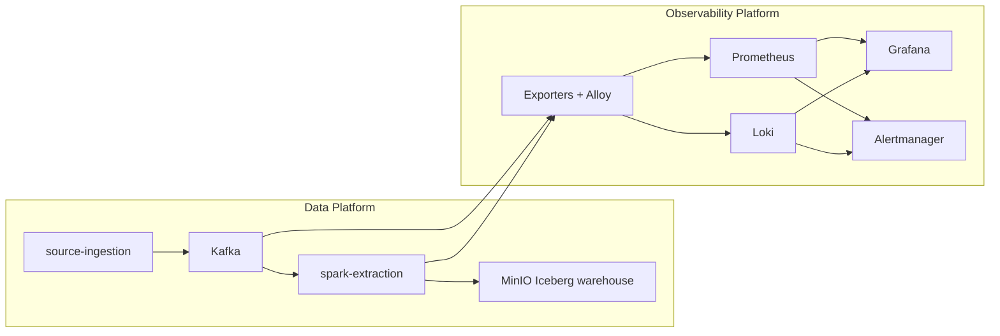
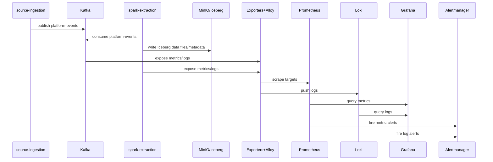
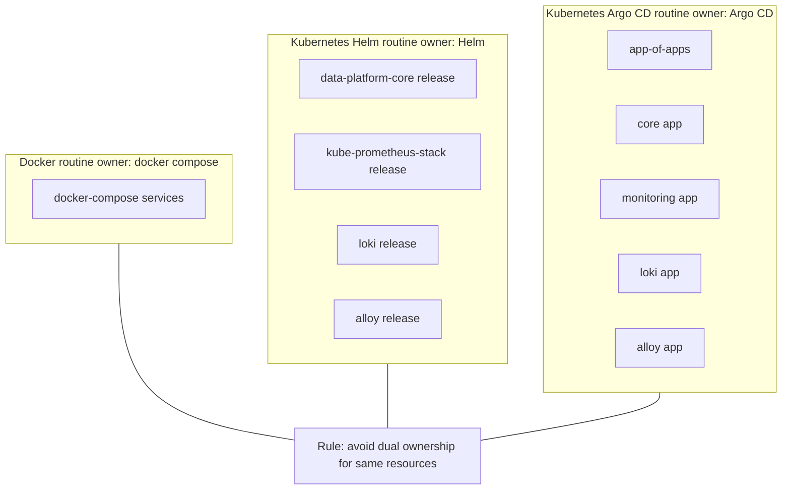
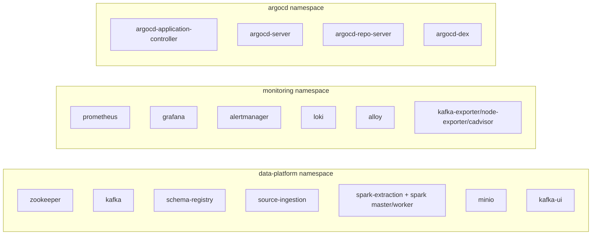

# Architecture

## 1. Design idea

This project is built around one operational idea:

- Run a realistic data pipeline and observability stack using repeatable routines.
- Keep deployment ownership explicit so routine execution is deterministic.
- Keep observability declarative so dashboards/datasources/alerts survive restarts and resets.

### Design principles

1. Telemetry-first operations: metrics, logs, and alerts are first-class deliverables.
2. Deterministic routines: Docker, Helm, and Argo CD routines are explicit and testable.
3. Clear ownership boundaries: each deployment path has a clearly defined owner.
4. Docs-as-operations: architecture, routines, and runbook stay synchronized.

## 2. System context

## 3. Runtime data and telemetry flow

## 4. Deployment ownership model

## 5. Routine-to-deployment mapping

| Routine target | Control plane | Expected deployment behavior |
| --- | --- | --- |
| `routine-up-docker` | Docker Compose | Starts local containers from `docker-compose.yml` |
| `routine-up-helm` | Minikube + Helm | Builds local images and installs Helm releases |
| `routine-up-argocd` | Minikube + Argo CD | Installs Argo CD and syncs app-of-apps |
| `routine-status-*` | Routine-specific | Reports health for the active routine |
| `routine-down-*` | Routine-specific | Stops local stack or minikube profile |

## 6. Relevant Kubernetes deployments by namespace

## 7. Reference URLs

- Prometheus docs: <https://prometheus.io/docs/introduction/overview/>
- Grafana docs: <https://grafana.com/docs/grafana/latest/>
- Loki docs: <https://grafana.com/docs/loki/latest/>
- Alloy docs: <https://grafana.com/docs/alloy/latest/>
- Argo CD docs: <https://argo-cd.readthedocs.io/en/stable/>
- kube-prometheus-stack chart: <https://github.com/prometheus-community/helm-charts/tree/main/charts/kube-prometheus-stack>
