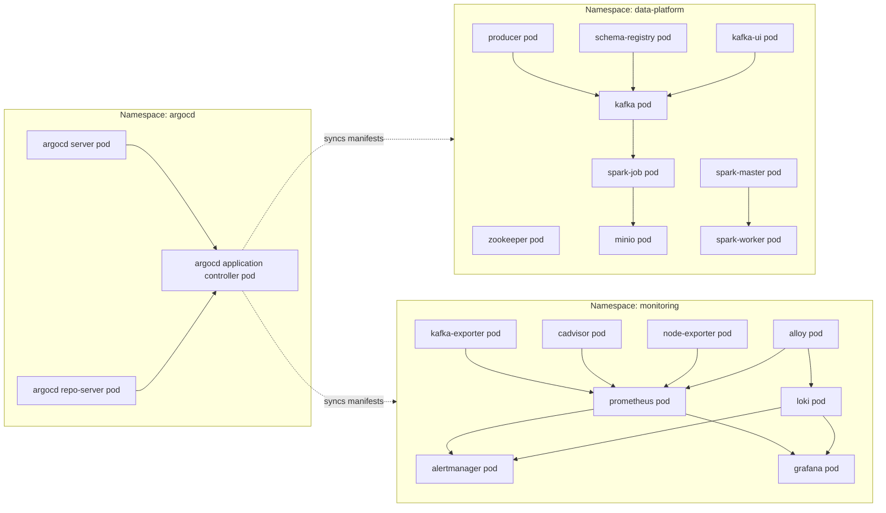

# Architecture

## Purpose

This project provides a local, Docker Compose based data platform with built-in metrics and log observability.

## Data Flow

1. `producer` publishes Avro events to Kafka topic `platform-events`.
2. `spark-job` consumes events from Kafka and writes processed records to Iceberg tables.
3. Iceberg table data is stored in MinIO (`platform-warehouse` bucket).

## Observability Flow

1. Prometheus scrapes metrics from:
   - `kafka-exporter`
   - `cadvisor`
   - `node-exporter`
   - `alloy`
2. Grafana reads Prometheus and Loki as data sources.
3. Prometheus evaluates metric alert rules and sends alerts to Alertmanager.
4. Alloy discovers Docker containers and sends logs to Loki.
5. Loki evaluates log rules and can also route alerts to Alertmanager.

## Runtime Components

### Core platform

- `zookeeper`
- `kafka`
- `schema-registry`
- `producer`
- `spark-master`
- `spark-worker`
- `spark-job`
- `minio`
- `kafka-ui`

### Monitoring and logging

- `prometheus`
- `grafana`
- `alertmanager`
- `loki`
- `alloy`
- `kafka-exporter`
- `cadvisor`
- `node-exporter`

## Kubernetes Pods Deployment (Minikube)

## Service and Browser Access Paths

```mermaid
flowchart TB
   BROWSER[Local browser]

   subgraph DOCKER[Docker Compose endpoints]
      GRAF_D[grafana:3000]
      PROM_D[prometheus:9090]
      LOKI_D[loki:3100]
      KUI_D[kafka-ui:8080]
      AM_D[alertmanager:9093]
      MINIO_D[minio console:9001]
   end

   subgraph K8S[Kubernetes endpoints via kubectl port-forward]
      PF_G[p-f svc/grafana -> localhost:3000]
      PF_P[p-f svc/kube-prometheus-stack-prometheus -> localhost:9090]
      PF_L[p-f svc/loki -> localhost:3100]
      PF_A[p-f svc/kube-prometheus-stack-alertmanager -> localhost:9093]
      PF_K[p-f svc/kafka-ui -> localhost:8080]
      PF_M[p-f svc/minio -> localhost:9001]
   end

   BROWSER --> GRAF_D
   BROWSER --> PROM_D
   BROWSER --> LOKI_D
   BROWSER --> KUI_D
   BROWSER --> AM_D
   BROWSER --> MINIO_D

   BROWSER --> PF_G
   BROWSER --> PF_P
   BROWSER --> PF_L
   BROWSER --> PF_A
   BROWSER --> PF_K
   BROWSER --> PF_M
```

## Configuration Layout

- `docker-compose.yml`: service wiring and dependencies.
- `alloy/config.alloy`: container discovery and Loki write pipeline.
- `prometheus/prometheus.yml`: scrape jobs.
- `prometheus/alert_rules.yml`: metric alerting rules.
- `loki/loki-config.yml`: Loki runtime configuration.
- `loki/rules/`: Loki recording and alerting rules.
- `grafana/provisioning/`: data source and dashboard provisioning.
- `grafana/dashboards/data-platform-overview.json`: default dashboard.

## Development Boundaries

- Optimized for local development on Docker Desktop.
- Credentials and endpoints are development defaults and should not be used for production.
- cAdvisor metrics are stable for container-level metrics by `id`; Compose service labels may vary by host runtime.
